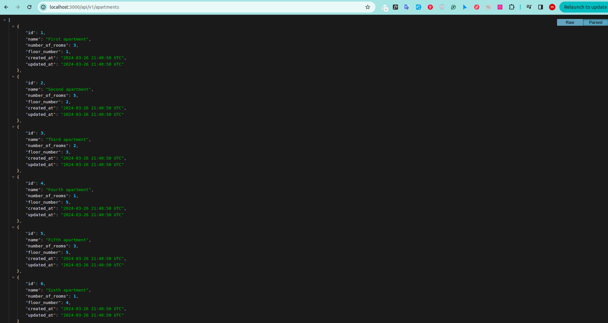
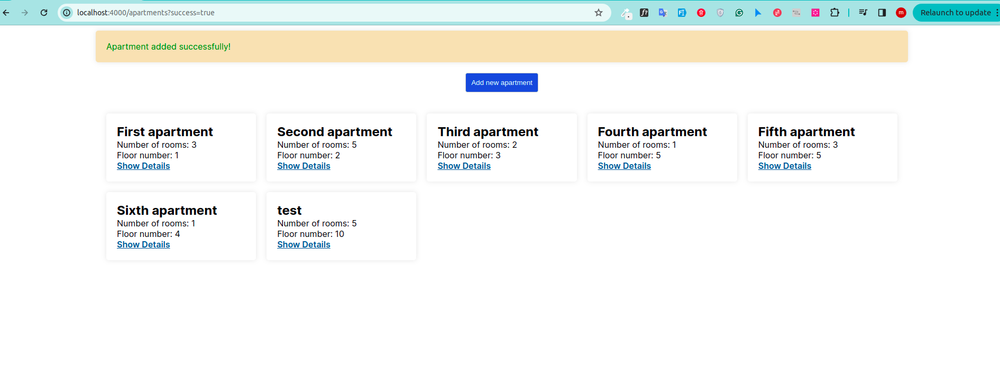
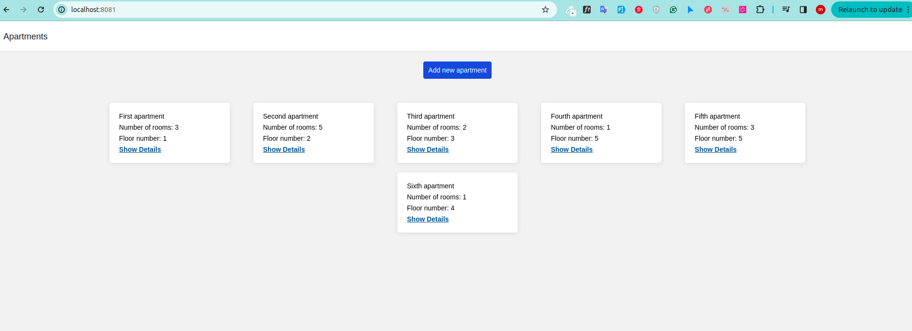

## Installation

```bash
git clone https://github.com/MohamedWalid0/Appartments
docker-compose up
```

## Usage

- Backend (Ruby on Rails)
  - Apartments list endpoint `http://localhost:3000/api/v1/apartments` type: `GET`
  - Apartment details endpoint `http://localhost:3000/api/v1/apartments/1` type: `GET`
  - Add New Apartment endpoint `http://localhost:3000/api/v1/apartments` type: `POST`


- Frontend (NextJS)
  - Apartments list endpoint `http://localhost:4000/apartments`
  - Apartment details endpoint `http://localhost:4000/apartments/1`
  - Add New Apartment endpoint `http://localhost:4000/apartments/new`

- Mobile Application (React Native)
  > __Note__: The mobile application needs a simulator to be tested, also I use expo you should be able to test it by `expo go` application but unfortunately the app can't access local endpoint!. NOW you can test it through the web view.
  - `http://localhost:8081`


## Images
  - Backend (Ruby on Rails)
    

  - Frontend (NextJS)
    

  - Mobile Application (React Native)
    